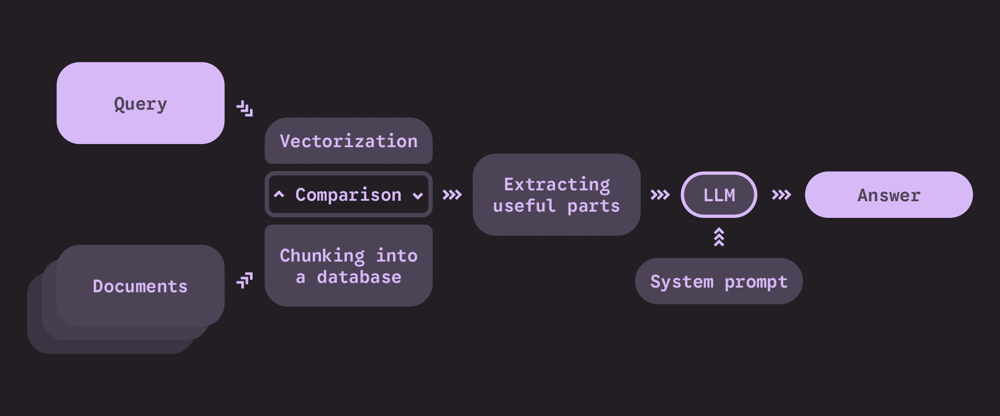

# Quick Start

1. Install [Python](https://python.org/downloads) 3.7 or above, and its dependencies: `pip3 install requests numpy scikit-learn tqdm` (other modules are already built-in)
2. Install and set up [Ollama](https://ollama.com/download)
3. Pull required models: `ollama pull nomic-embed-text:latest` and `ollama pull llama3.1:8b`
4. Place your `.txt` files in the `documents` folder
5. Run the script in a cli: `python3 rag.py`

---

# What is RAG?

Large Language Models (**LLMs**) perform well with small contexts, but when processing information from larger documents, they may begin to forget details or hallucinate (make things up). Additionally, they often answer based on their training knowledge, even when a specific context is provided. **RAG** (Retrieval-Augmented Generation) bypasses these two problems. First, RAG uses a **system prompt** to force the model to answer in a desired behavior (here, based ONLY on the provided documents). The prompt also tells the model to state when it lacks sufficient information to provide a proper answer.
Note: While you can use a system prompt without RAG, you cannot effectively use RAG without a system prompt!

RAG also involves **chunking** documents into smaller pieces. It then retrieves only the relevant parts that correspond to the user's question. This is done through semantic similarity comparison (a 'meaning' comparison, rather than regular word matching). This process significantly reduces the context size, which in turn helps to reduce hallucinations. Here is a diagram that roughly explains how the system works:


RAG is helpful for many applications that require specific information, for example:
- Virtual assistant for customers
- Private document analysis
- Natural language querying

# How the `rag.py` Script Works

The script follows standard RAG logic but includes some additional tweaks that I found improve accuracy during testing:

## 1. Chunking Strategies

The script supports two different chunking strategies:

- **Fixed Chunking**: Splits your documents into overlapping chunks of a fixed word count with configurable chunk size and overlap. This helps maintain context across arbitrary text boundaries. The overlap is useful for preserving context across sentence boundaries, ensuring that important information spanning chunk boundaries is not lost.

- **Natural Chunking**: Splits your documents by line breaks, preserving natural document structure. This works well for well-structured documents where logical breaks follow line boundaries. However, depending on the documents, it may create very large or very small chunks, which can affect accuracy. This method does not use overlap, as line breaks typically separate contexts by default. This is the default and recommended method.

## 2. Embedding and Storing the Chunks

Each chunk is converted into a high-dimensional vector (**embedding**) using the embedding model of your choice. These embeddings capture the semantic meaning of the text in numerical form. This is basically how LLMs understand and compare the meaning of text. The script processes embeddings in parallel to improve performance, with a progress bar showing the indexing status (failed embeddings are filtered out).
All chunks and their corresponding embeddings are then stored in a **pickle file** for persistence. The system maintains separate indexes for fixed and natural chunks, which allows users to choose their preferred chunking strategy during retrieval. This also helps the LLM understand the order and origin of the chunks.

## 3. Handling User Prompts

When a user asks a question, the system creates an embedding of the query (just like the chunks) and uses cosine similarity to find the most semantically similar document chunks. It then filters results by a similarity threshold to ensure a minimum matching score and number of retrieved chunks. Finally, the retrieved chunks are combined with the user query into a context prompt, which is then sent to the LLM for it to (hopefully) answer as the user expected.

## 4. Error Handling

The script includes basic error handling, intended for user assistance (not debugging). For example:
- Missing or unreachable Ollama server
- Handling of failed embeddings
- Corrupted or outdated index files
- Network timeouts and connection errors
- File reading errors or missing files
- Invalid configuration values

# How to Use

## Requirements and Dependencies

You will need a reasonably powerful computer. The amount of hardware required depends on the volume of data you intend to process and the level of accuracy you expect. I recommend:
- A strong NVIDIA GPU with a lot of VRAM
- Plenty of RAM

The script requires several **Python** packages (and of course [Python](https://python.org/downloads) itself) to handle the script logic and orchestration. Install them with:
```bash
pip install requests numpy scikit-learn tqdm
```

Note: `pickle`, `json`, and `os` are built into Python, so you don't need to install them separately.

You will also need **Ollama**. [Ollama](https://ollama.com/download) allows you to download and run models locally. You will need both an embedding model (for vectorizing text) and a language model (for generating responses) installed in Ollama before running the script. You can download the models you want or even host them separately.

## File Architecture
```
project_directory/
├── rag.py
└── documents/              # Documents folder (auto-created)
    ├── settings.json       # Configuration file (auto-created)
    ├── YourFirstDocument.txt
    ├── YourOtherDocument.txt
    └── chunk_database.pkl  # Generated index file (auto-created)
```

The system creates the `documents` folder and a default `settings.json` file. You only need to place your documents to rag in this folder (`.txt` only).

If there is no chunk database already, it will build an index of your documents, which may take time depending on document size and embedding model speed. The system automatically loads existing indexes on subsequent runs but offers the option to rebuild them (useful when documents change).

## Configuration File and Settings

The `settings.json` file is used to manage persistent settings. I recommend sticking to the default values (which are also the ones I used) if you have limited hardware or knowledge. You can either edit the file directly or use run commands to modify the parameters (see the next section for details). Here is what each setting does:

- **OLLAMA_HOST**: The URL of your Ollama server (defaults to http://localhost:11434 for a local setup but can be pointed to any host).
- **LLM_MODEL**: The model used for response generation. A higher number of parameters typically results in better quality but slower performance.
- **EMBEDDING_MODEL**: The model used for generating embeddings
- **CHUNK_SIZE**: Number of words per fixed chunk.
- **OVERLAP_SIZE**: Word overlap between consecutive chunks.
- **TOP_K_RESULTS**: Maximum number of chunks to retrieve.
- **SIMILARITY_THRESHOLD**: The minimum similarity score for a chunk to be included. A higher value increases the likelihood that the model will state it lacks information, while decreasing the chance of providing incorrect answers.
- **SYSTEM_PROMPT**: Instructions for the language model. You can (and should) customize this to guide the model's behavior and provide context on its use, which may prevent it from withholding information.
- **DOCUMENTS_DIR**: The directory where everything is stored.
- **STORAGE_FILE**: The file where the 'database' is stored.
- **REQUEST_TIMEOUT**: Timeout for API requests in seconds.
- **TEMPERATURE**: Controls the randomness of the responses. A value of 0 is highly recommended for predictable output.
- **SEARCH_MODE**: Selects which index to use ('fixed' or 'natural'). I recommend 'natural' for most cases.

## On-Run Commands and Usage

The interactive CLI supports several commands:

- **quit/exit**: Exit the program
- **help**: Display available commands
- **rebuild**: Regenerate the entire index from documents
- **settings**: View and modify configuration parameters (changes persist to settings.json)
- **temp_settings**: View and modify configuration parameters (changes are temporary and only apply for the current session)
- **view**: Examine stored chunks and their embeddings (choose between fixed/natural databases)

Any input that isn't a command is treated as a question for the LLM. The retrieved chunks will be displayed, and the model will provide an answer.

Here is some examples :
```
[Mode: natural | Temp: 0.0] Enter your question or command: settings

--- Current Permanent Settings ---
OLLAMA_HOST: http://localhost:11434
LLM_MODEL: llama3.1:8b
EMBEDDING_MODEL: nomic-embed-text:latest
CHUNK_SIZE: 200
OVERLAP_SIZE: 20
TOP_K_RESULTS: 5
SIMILARITY_THRESHOLD: 0.25
SYSTEM_PROMPT: You are an AI assistant. Answer questions only using the provided documents. Be precise. If the documents don't contain the information, say clearly that you cannot answer due to lack of information.
DOCUMENTS_DIR: documents
STORAGE_FILE: documents/chunk_database.pkl
REQUEST_TIMEOUT: 300.0
TEMPERATURE: 0.0
SEARCH_MODE: natural
------------------------
Enter the setting to change (or press Enter to cancel): SEARCH_MODE
Enter the new value for 'SEARCH_MODE': fixed
Configuration saved successfully.
Settings updated permanently. A 'rebuild' may be required for some changes to take effect.
```
```
[Mode: natural | Temp: 0.0] Enter your question or command: view
Which database to view? (fixed/natural): fixed
How many chunks to show from the top? (total 36): 2

--- Chunk 1 ---
File: YourDocument.txt, Chunk ID: 0
Text: blabla...

--- Chunk 2 ---
File: YourDocument.txt, Chunk ID: 1
Text: some more blabla...
```

# Limitations

- **Overall performance**: The speed and quality of the output heavily depend on the models used and your settings (I recommend the models from Meta). Additionally, the LLM outputs are hard to troubleshoot because there is no feedback, errors, or logs. Furthermore, Python's limited performance and the poor optimization of my script also contribute to these issues.
- **File format limitation**: The script only supports `.txt` files. Other formats such as `.pdf`, `.docx`, or images are not supported.
- **No UI or API**: This is a command-line tool, but RAG is typically intended for regular users.. To be honest, it is a personal project and it was never intended for scale.
- **Weak testing**: Due to my limited hardware, the script has been tested with relatively small models and documents. I assume that larger models will yield better results, but I cannot guarantee it.

<3
